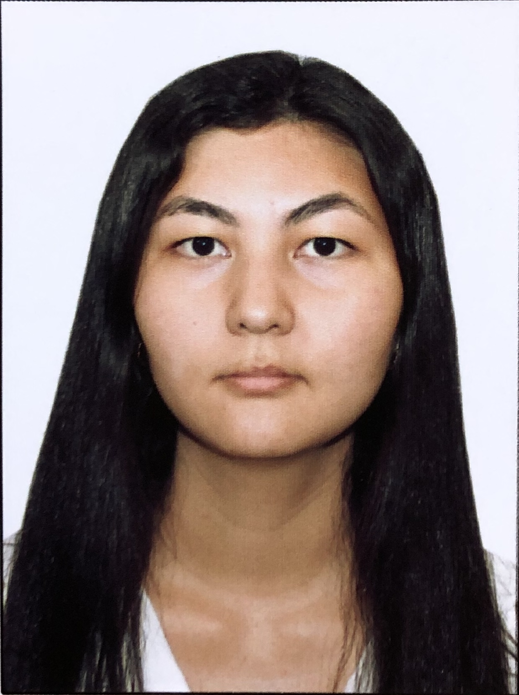

<html lang="en">
<head>
    <meta charset="UTF-8">
    <meta http-equiv="X-UA-Compatible" content="IE=edge">
    <meta name="viewport" content="width=device-width, initial-scale=1.0">
    
</head>
<body>
    

    <table>
        <tr>
        <td>
        </td>
    <td><h1>Zhazira Yessimova</h1>
    
<em>Senior curator at <a href="https://blancooeducation.com/">Blancoo education</a></em>

     <em>I help people in applying for their dream university in Italy 🇮🇹</em></td>
    </tr>
    </table>
    

    

    <h3>Content table</h3>
    <uol>
    <li><a href="#t1">Age</a></li>
    <li><a href="#t2">About me</a></li>
    <li><a href="#t3">Work Experience</a></li>
    <li><a href="#t4">Education</a></li>
    <li><a href="#t5">Skills</a></li>
    <li><a href="#t6">Hobbies</a></li>
    <li><a href="#t6">Contacts</a></li></uol>

    
<strong>Age: 25</strong>

    
<strong>DOB: 10.05.1997</strong>

    
<strong>Citizenship: Kazakhstan</strong>

    
<strong>Gender: Female</strong>

    <h2 id="t2">About me</h2>
    
<em>I am an eternal learner. Being a highly motivated and sociable team player, I reckon that 
        it is vital to have a big picture in mind and only then look at the details. This mindset 
        helps me to come up with the most rational and effective solution to almost any problem that 
        comes up. I am also passionate to learn new things and gain experience in fields other than 
        my major.
        I was genuinely interested in programming since middle school, when we were first introduced to 
        IT subject at school. However, I did not pursue my passion in learning programming because of 
        my fear and stigma that girls are not good at IT. But here I am now, finally dedicating time to 
        learn what I am passionate about. I hope that this course in web development from decode.kz will 
        help me to headstart in the IT industry.</em>

        <h2 id="t3">Work Experience</h2>
        <uol>
            <li>Worked as summer intern at Kerry Logistics in 2018</li>
            <ul><li>performed daily freight operations in the ocean freight department</li>
            <li>gathered information for the presentation about opportunities in CIS region</li></ul>
            <li>Worked as a data clerk at Reeracoen HK in 2018</li>
            <ul><li>consolidated and analysed incoming data</li>
            <li>called prospective employees and examined their resumes</li></ul>
            <li>Worked as a UN Volunteer at UNESCO Office in Tashkent in 2019</li>
            <ul><li>assissted in the department of education</li>
            <li>conducted and transcribed interviews</li>
            <li>took care of all the logistics and organisation of events at the office</li></ul>
            <li>Currently working as a senior curator at educational agency</li>
            <ul><li>taking care of the whole process of application to the foreign universities</li>
            <li>conducting consultations with prospective clients</li>
            </ul>
        </uol>

        <h2 id="t4">Education</h2>
        <uol>
        <li>BBA in International Shipping Logistics at HKPU, 2019</li>
        <li>High School Diploma from NIS in Pavlodar, 2015</li></uol>

        <h2 id="t5">Skills</h2>
        <ol>
            <li>HTML, CSS, Javascript</li>
            <li>MS Office</li>
            <li>Adobe Illustrator, Photoshop</li>
        </ol>

        <h2 id="t6">Hobbies</h2>
        <ol type="i">
            <li>Martial arts</li>
            <li>Language learning</li>
            <li>Traveling</li>
        </ol>

        <h2 id="t6">Contacts</h2>
        
My <a href="./myeuropasscv.html">Europass CV</a>

        
          
        <form>
            <input type="text" placeholder="Enter name"> 
            <input type="text" placeholder="Phone number">  
            <input type="submit" value="Submit">
        </form>
</body>
</html>
